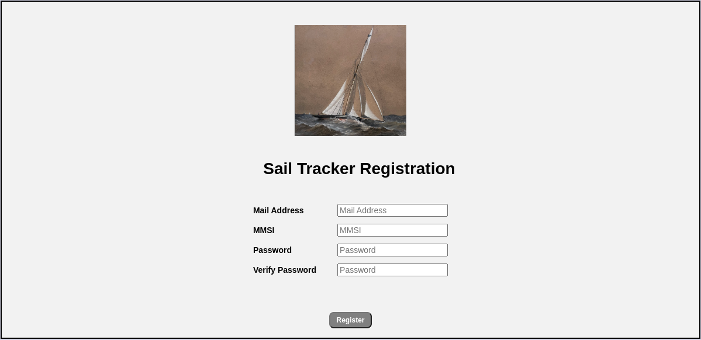
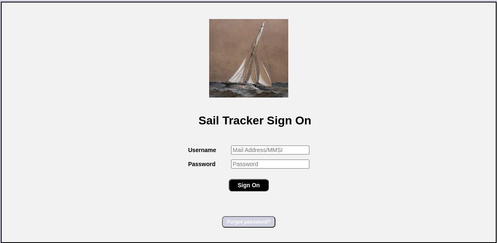
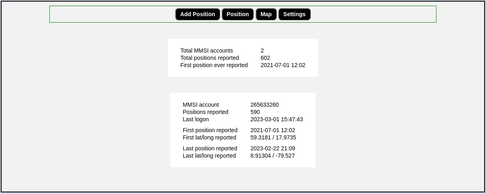
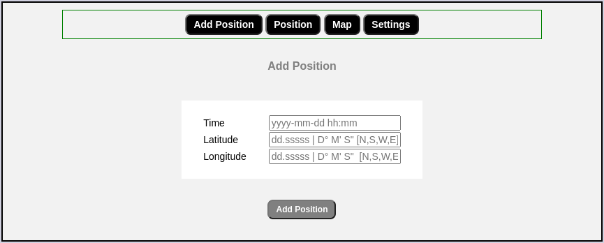
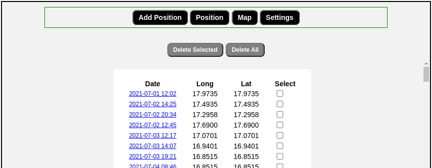
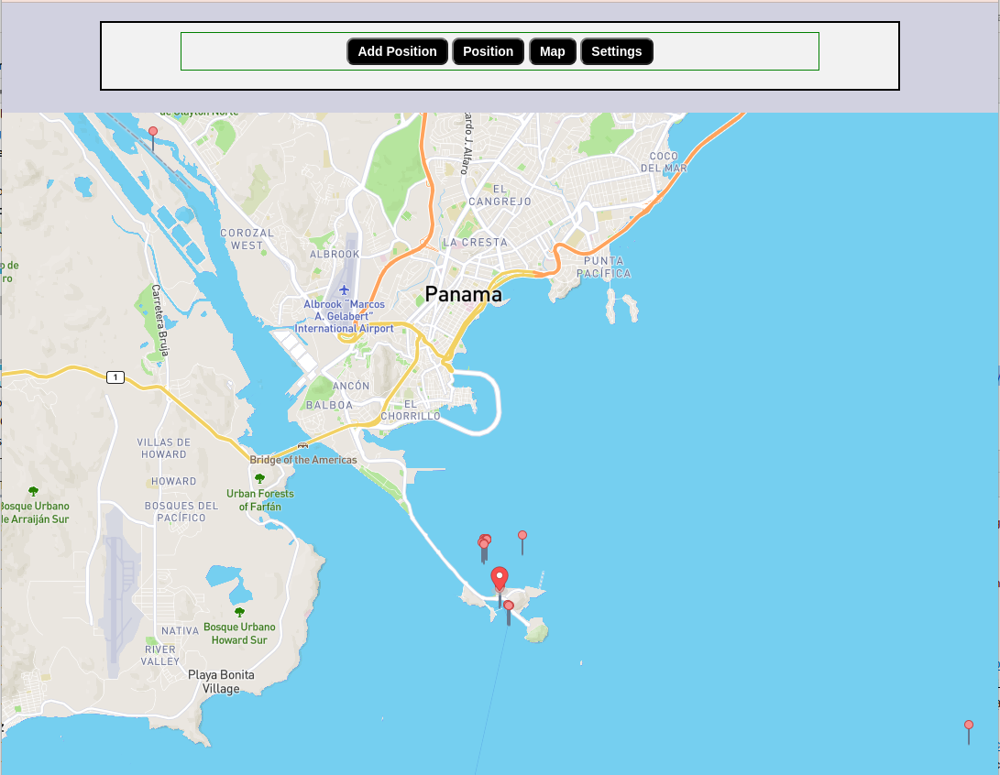

# SailTracker
*SailTracking* is a Web App allowing long distance sharing sailers yo share position and routes with near and love ones by
tracking boats and their routes via public AIS transponders and/or smartphones.

Normally long distance sailing boats are equipped with [AIS](https://www.imo.org/en/OurWork/Safety/Pages/AIS.aspx) transponders allowing the boat/ship to be tracked. The boat is periodically reporting its position. There are a few public online AIS services on Internet exposing the  latest known boat/ship position.

The SailTracking App can automatically track and keep a history of the boat/ship positions given that the boat/ ship has been registered in the SailTracking App.

Boats / ships are identified by its AIS i.e [MMSI](https://en.wikipedia.org/wiki/Maritime_Mobile_Service_Identity) .

The SailTracker App can extract boat positions being reported via land based AIS stations. Online AIS services are also able to collect boat/ship positions reported via satellites. However these satellite positions are only available if you have a paid subscriptions, that is fairly expensive for a hobbyist project.

So in areas where the land bases AIS coverage is poor or when being far out from land positions will not be publicly available.

To mitigate this problem, positions can be collected manually and reported via the SailTracking App when having an Internet connections.

An Iphone App has been built to collect positions for later reporting to the SailTracker App. You can find info about it at https://github.com/hoddmimes/ShipPosition.

Another possible reporting mechanism are SMS/e-mail from a satelitte telephone. A few satellite  phones have built-in functions for sending their positions via SMS or e-mail. Would be nice to have the functionality in the SailTracker for receiving and parsing satellite emails/SMS 😄

### Public Map for a boat/ship
A public map is available for registered boat via de link 
_http://<host>/sailtracker/map.html?mmsi=<boat-mmsi>_ 
an example is available [here for Matilda Sailing ](https://hoddmimes.com/sailtracker/map.html?mmsi=265633260). 

**A deployed instance of _SailTracker_ is available at**
https://hoddmimes.com/sailtracker/index.html

